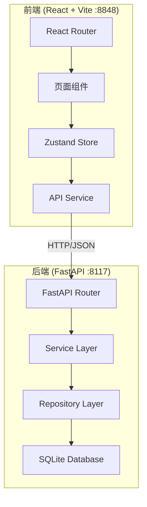
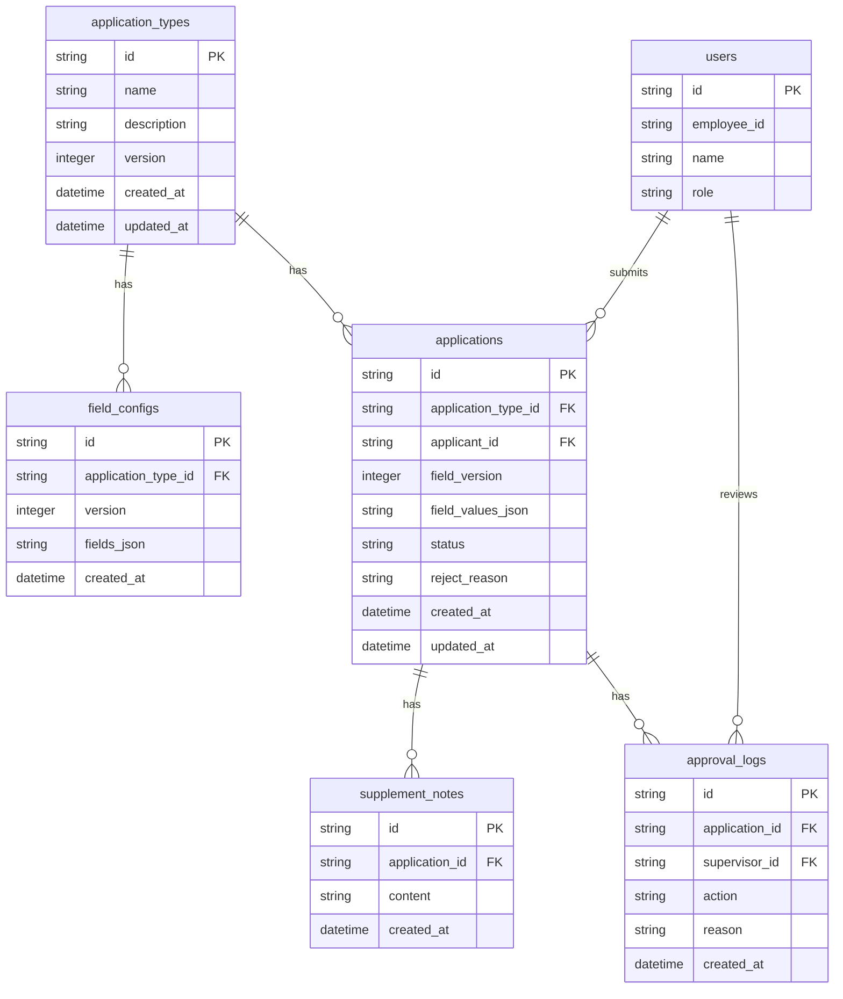

## 1. 架构设计



## 2. 技术说明

- 前端：React@18 + TypeScript + Vite + TailwindCSS@3 + Zustand
- 初始化工具：vite-init (react-ts 模板)
- 后端：FastAPI (Python 3.10+)
- 数据库：SQLite (通过 aiosqlite 异步访问)
- 前后端通信：REST API，JSON 格式
- 前端端口：8848，后端端口：8117

## 3. 路由定义

| 路由 | 用途 |
|------|------|
| `/login` | 登录页，角色选择 |
| `/admin/types` | 管理员-申请类型列表 |
| `/admin/types/:id/fields` | 管理员-字段配置 |
| `/executor/apply` | 执行人-新建申请 |
| `/executor/applications` | 执行人-我的申请列表 |
| `/executor/applications/:id` | 执行人-申请详情与补充 |
| `/supervisor/applications` | 监督人-审批列表 |
| `/supervisor/applications/:id` | 监督人-审批详情与操作 |
| `/supervisor/export` | 监督人-数据导出 |

## 4. API 定义

### 4.1 认证接口

```
POST /api/auth/login
  Body: { role: "admin" | "executor" | "supervisor", employee_id: string }
  Response: { token: string, role: string, name: string }
```

### 4.2 申请类型接口

```
GET    /api/application-types              # 获取所有申请类型
POST   /api/application-types              # 创建申请类型
PUT    /api/application-types/{id}         # 更新申请类型
DELETE /api/application-types/{id}         # 删除申请类型
GET    /api/application-types/{id}/fields  # 获取类型的当前字段配置
POST   /api/application-types/{id}/fields  # 批量更新字段配置（生成新版本）
```

### 4.3 申请接口

```
POST   /api/applications                    # 提交申请（保存字段快照）
GET    /api/applications                    # 获取申请列表（支持筛选）
GET    /api/applications/{id}               # 获取申请详情（含字段快照）
PUT    /api/applications/{id}/supplement    # 补充材料说明
PUT    /api/applications/{id}/resubmit      # 退回后重新提交
```

### 4.4 审批接口

```
GET    /api/approvals                       # 获取待审批列表
PUT    /api/approvals/{id}/approve          # 审批通过
PUT    /api/approvals/{id}/reject           # 审批退回
Body: { reason: string }
```

### 4.5 导出接口

```
GET    /api/export?application_type_id=&status=&start_date=&end_date=  # 导出CSV
```

### 4.6 TypeScript 类型定义

```typescript
interface FieldType {
  id: string
  name: string
  type: "text" | "number" | "date" | "select" | "multiselect" | "textarea"
  required: boolean
  options?: string[]
  sort_order: number
}

interface ApplicationType {
  id: string
  name: string
  description: string
  fields: FieldType[]
  version: number
  created_at: string
  updated_at: string
}

interface FieldSnapshot {
  version: number
  fields: FieldType[]
  snapshot_at: string
}

interface Application {
  id: string
  application_type_id: string
  application_type_name: string
  applicant_id: string
  applicant_name: string
  field_snapshot: FieldSnapshot
  field_values: Record<string, any>
  status: "pending" | "approved" | "rejected" | "resubmitted"
  supplement_notes: string[]
  reject_reason?: string
  created_at: string
  updated_at: string
}
```

## 5. 服务端架构图

```mermaid
flowchart LR
    "Router" --> "Service"
    "Service" --> "Repository"
    "Repository" --> "SQLite"
```

## 6. 数据模型

### 6.1 数据模型定义



### 6.2 数据定义语言

```sql
CREATE TABLE users (
    id TEXT PRIMARY KEY,
    employee_id TEXT NOT NULL UNIQUE,
    name TEXT NOT NULL,
    role TEXT NOT NULL CHECK(role IN ('admin', 'executor', 'supervisor'))
);

CREATE TABLE application_types (
    id TEXT PRIMARY KEY,
    name TEXT NOT NULL,
    description TEXT DEFAULT '',
    version INTEGER NOT NULL DEFAULT 1,
    created_at TEXT NOT NULL DEFAULT (datetime('now')),
    updated_at TEXT NOT NULL DEFAULT (datetime('now'))
);

CREATE TABLE field_configs (
    id TEXT PRIMARY KEY,
    application_type_id TEXT NOT NULL,
    version INTEGER NOT NULL,
    fields_json TEXT NOT NULL,
    created_at TEXT NOT NULL DEFAULT (datetime('now')),
    FOREIGN KEY (application_type_id) REFERENCES application_types(id)
);

CREATE TABLE applications (
    id TEXT PRIMARY KEY,
    application_type_id TEXT NOT NULL,
    applicant_id TEXT NOT NULL,
    field_version INTEGER NOT NULL,
    field_values_json TEXT NOT NULL DEFAULT '{}',
    status TEXT NOT NULL DEFAULT 'pending' CHECK(status IN ('pending', 'approved', 'rejected', 'resubmitted')),
    reject_reason TEXT DEFAULT '',
    created_at TEXT NOT NULL DEFAULT (datetime('now')),
    updated_at TEXT NOT NULL DEFAULT (datetime('now')),
    FOREIGN KEY (application_type_id) REFERENCES application_types(id),
    FOREIGN KEY (applicant_id) REFERENCES users(id)
);

CREATE TABLE supplement_notes (
    id TEXT PRIMARY KEY,
    application_id TEXT NOT NULL,
    content TEXT NOT NULL,
    created_at TEXT NOT NULL DEFAULT (datetime('now')),
    FOREIGN KEY (application_id) REFERENCES applications(id)
);

CREATE TABLE approval_logs (
    id TEXT PRIMARY KEY,
    application_id TEXT NOT NULL,
    supervisor_id TEXT NOT NULL,
    action TEXT NOT NULL CHECK(action IN ('approve', 'reject')),
    reason TEXT DEFAULT '',
    created_at TEXT NOT NULL DEFAULT (datetime('now')),
    FOREIGN KEY (application_id) REFERENCES applications(id),
    FOREIGN KEY (supervisor_id) REFERENCES users(id)
);

CREATE INDEX idx_applications_status ON applications(status);
CREATE INDEX idx_applications_applicant ON applications(applicant_id);
CREATE INDEX idx_applications_type ON applications(application_type_id);
CREATE INDEX idx_field_configs_type_version ON field_configs(application_type_id, version);
CREATE INDEX idx_supplement_notes_application ON supplement_notes(application_id);
CREATE INDEX idx_approval_logs_application ON approval_logs(application_id);

INSERT INTO users (id, employee_id, name, role) VALUES
    ('u1', 'A001', '张管理', 'admin'),
    ('u2', 'E001', '李执行', 'executor'),
    ('u3', 'S001', '王监督', 'supervisor'),
    ('u4', 'E002', '赵执行', 'executor');
```
